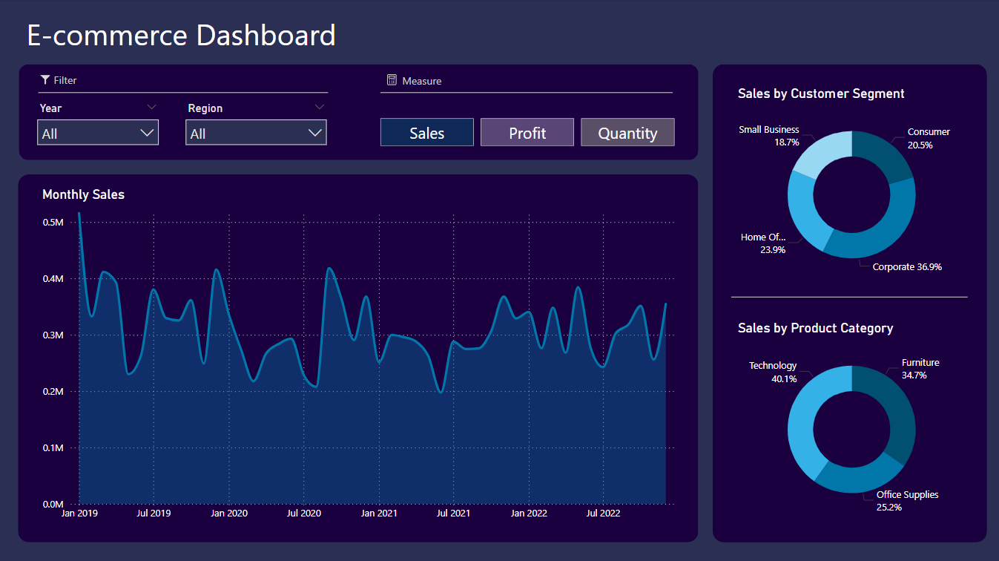

# E-commerce Sales Dashboard

## Project Overview
This project focuses on analyzing e-commerce sales data to create a comprehensive dashboard. The goal is to provide an insightful overview of sales, profit, and quantity sold, segmented by year and region. The dashboard further categorizes these metrics by customer segment and product category to highlight general trends in the data.

## Dashboard Features
The dashboard provides a visual representation of e-commerce metrics with the ability to drill down into more detailed views based on various business dimensions:
- **Yearly and Regional Breakdowns**: Overview of sales, profit, and quantity sold by year and region.
- **Customer Segments and Product Categories**: Distribution of metrics by customer segment and product category.
- **Product Subcategories and Customer Segment Details**: Detailed analysis of sales and profit margins by product subcategory and customer segment.

### Interactive Elements
- **Dropdown Menus**: Users can apply filters to the data to view specific metrics.
- **Selection Buttons**: Allows users to toggle between sales, profit, and quantity measures.

## Dashboard Snapshots
Here are some snapshots of the dashboard to illustrate the features and the insights it can provide:

### Sales Overview by Year and Region

### Profit Analysis

### Quantity Sold 

### Sales Analysis by Product Sub Categories 

### Profit Analysis by Product Sub Categories 

## Files in Repository
- `E-commerce dashboard.pbix`: Power BI file containing the e-commerce dashboard.
- `EDA-orders.ipynb`: Jupyter notebook for exploratory data analysis on e-commerce orders.
- `orders.csv`: Original dataset of e-commerce orders.
- `orders_cleaned.csv`: Cleaned and preprocessed dataset used for the dashboard.

## How to Use
1. Clone the repository to your local machine.
2. Open the `E-commerce dashboard.pbix` in Power BI.
3. Run `EDA-orders.ipynb` in a Jupyter environment to view the exploratory data analysis.
4. Explore the dashboard using the provided interactive elements to gain insights into e-commerce sales performance.

## License
This project is licensed under the MIT License - see the [LICENSE.md](LICENSE.md) file for details.
